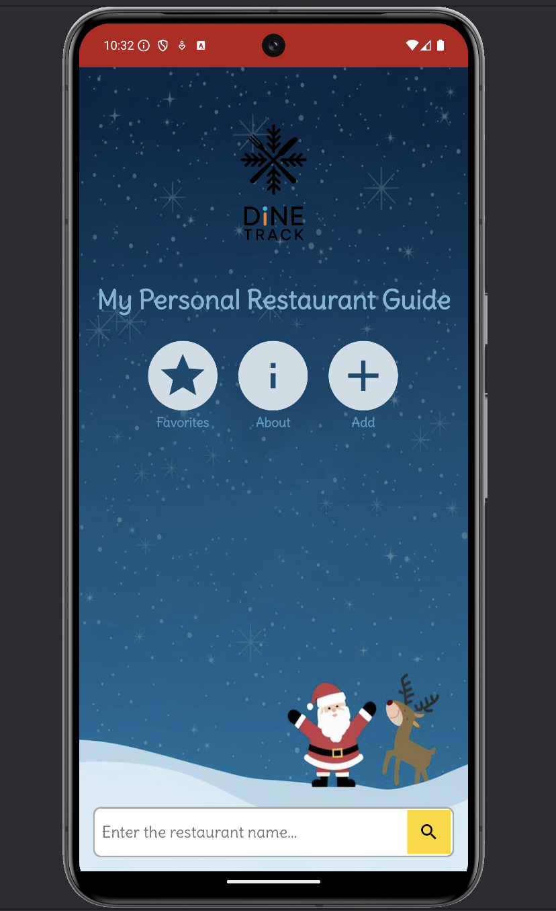
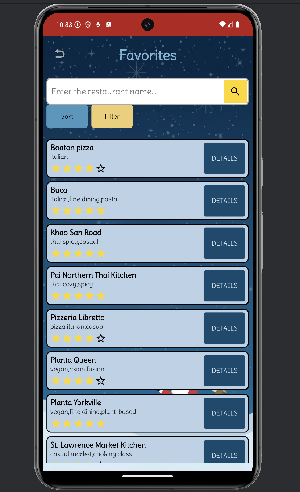
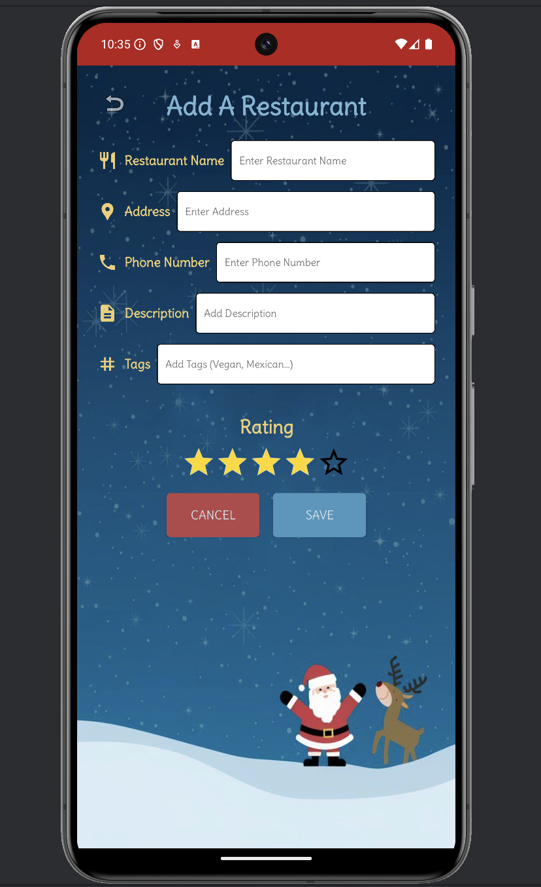
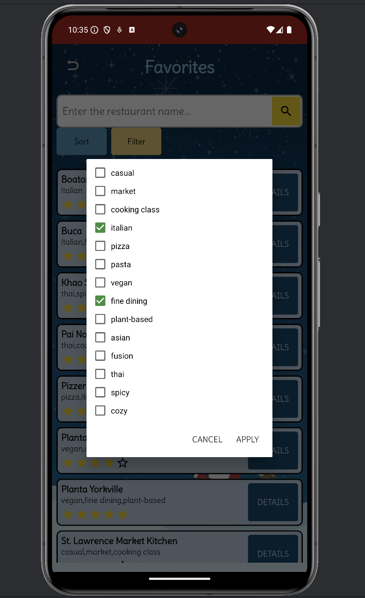
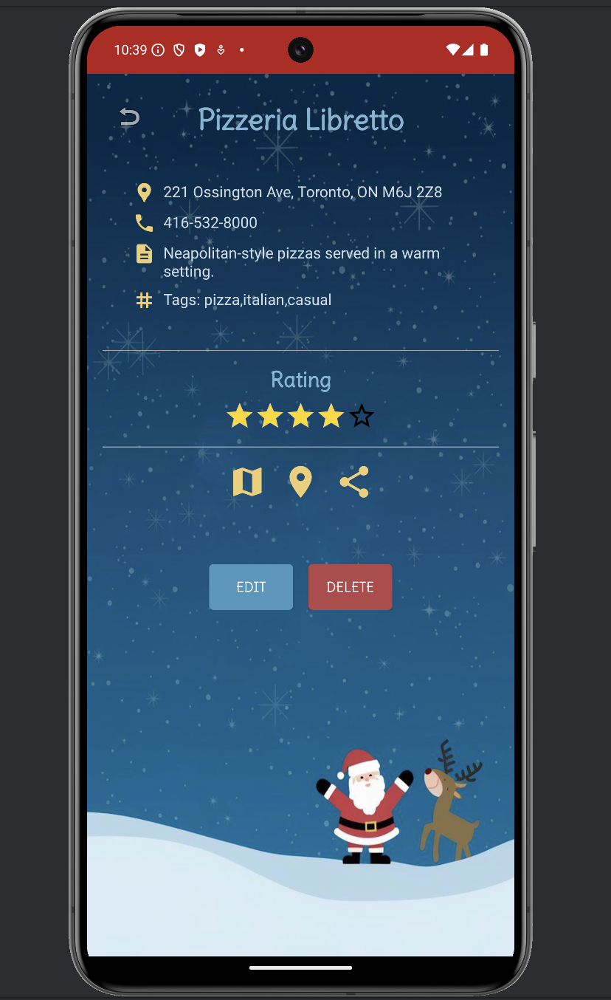
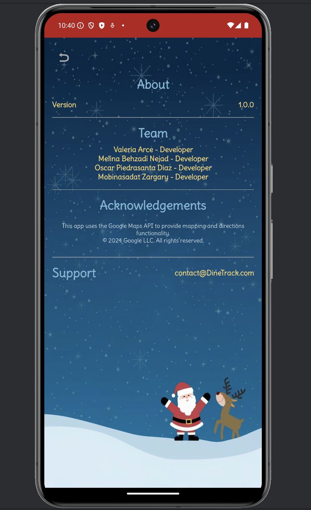

# 🎄 DineTrack - Personal Restaurant Guide

DineTrack is a mobile application developed as a group project by a team of developers for tracking and reviewing personal favorite restaurants. The app features intuitive navigation, detailed restaurant information, personalized ratings, and robust filtering options, making dining decisions effortless and enjoyable.

## 🌟 Project Overview

Developed collaboratively as part of our final group project in December, we embraced the festive spirit by incorporating a cheerful Christmas theme into our design. DineTrack allows users to:

- Add new restaurants with detailed descriptions and tags.
- Maintain a favourites list with ratings.
- View and filter favourite restaurants by categories and tags.
- Access detailed restaurant pages, including addresses, descriptions, tags, and user ratings.
- Navigate easily to restaurants using built-in map functionalities.

## 🎅 Christmas Themed UI

Given the timing of our project completion in December, our team designed the app interface with a joyful Christmas theme, featuring Santa, reindeer, and snowy visuals to enhance user experience during the holiday season.

## 📌 Features Implemented

- **CRUD Operations:** Ability to create, read, update, and delete restaurant entries.
- **Search and Filter:** Efficient search functionality with filtering by tags and categories.
- **Star Rating System:** Interactive rating system for user feedback.
- **Google Maps Integration:** Provided navigation and map visualization to restaurants.
- **Data Persistence:** Implemented local storage using SQLite for persistent data management.
- **Custom UI Components:** Designed reusable UI components for consistent app-wide styling.

## 🛠 Tech Stack

- **Android Development:** Implemented in Java using Android Studio.
- **Database:** SQLite used for local data storage.
- **Maps and GPS:** Integrated Google Maps API for accurate navigation and location services.
- **UI/UX Design:** XML layouts with custom components for a responsive and visually appealing interface.

📸 **Screenshots**

### Landing Page

### Favorites Page

### Add Restaurant

### Filter Options

### Restaurant Details

### About the Team

## 👥 Team Members

- **Valeria Arce** - Developer
- **Melina Behzadi Nejad** - Developer
- **Oscar Piedrasanta Diaz** - Developer
- **Mobinasadat Zargary** - Developer

## 🛠 Acknowledgements

This app leverages the Google Maps API to provide seamless mapping and directions functionality.

© 2024 Google LLC. All rights reserved.

## 📬 Support

For inquiries or feedback, please contact any of the developers via email.

Oscar - oscarpiediaz@gmail.com

---

Enjoy tracking your culinary adventures with DineTrack! 🍽🎉
